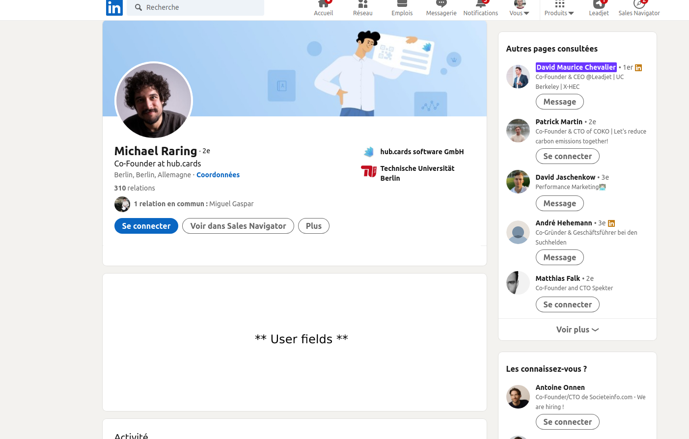

# chrome-ext

## Task

Create a Chrome extension that will inject user information coming from the https://randomuser.me/ API, into any LinkedIn profile such as https://www.linkedin.com/in/david-maurice-chevalier/

## Getting Started

